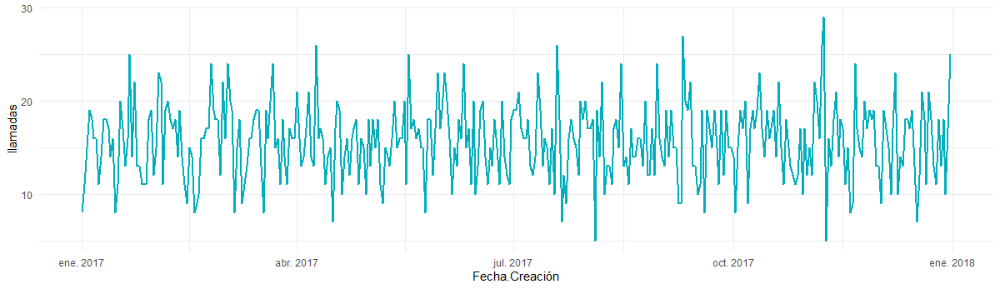

```{r setup, include=FALSE}
knitr::opts_chunk$set(echo = TRUE)
library(nycflights13)
library(tidyverse)
library(lubridate)
library(readr)
library(readxl)
library(openxlsx)
library(chron)
library(knitr)
hook_output = knit_hooks$get('output')
knit_hooks$set(output = function(x, options) {
  # this hook is used only when the linewidth option is not NULL
  if (!is.null(n <- options$linewidth)) {
    x = knitr:::split_lines(x)
    # any lines wider than n should be wrapped
    if (any(nchar(x) > n)) x = strwrap(x, width = n)
    x = paste(x, collapse = '\n')
  }
  hook_output(x, options)
})
```

## Primer inciso

Para calcular el resultado hice unas dimensiones propias. Luego las sumé.

```{r }
## Primer inciso
# Ignorando zona horaria que no es importante en fenómenos astronómicos
# Creando la fecha base
x <- '21 de agosto del 2017 a las 18:26:40'
x <- dmy_hms(x)

# Creando las dimensoiones astronómicas medievales
synodic <- ddays(29) + dhours(12) + dminutes(44) + dseconds(3)

saros <- 223*synodic

# Fecha final 
pred <- x + saros

resp <- paste0("La fecha del siguiente eclipse es ", pred, sep=" ")

resp
```

## Segundo inciso

1. El mes en que hay más llamadas por código es:
**Marzo, con 497 llamadas**

```{r }
data <- read.csv("data.csv", sep=";")

data$`Fecha.Creación` <- dmy(data$`Fecha.Creación`)


data$`Fecha.Final` <- dmy(data$`Fecha.Final`)


primer <- data %>% group_by(month(Fecha.Creación), Cod) %>% summarise(llamadas = sum(Call)) %>% filter(llamadas > 0) %>% arrange(desc(llamadas))
primer <- primer %>% rename(mes = `month(Fecha.Creación)`)
head(primer, 1)
```

2. El día más ocupado es:
**Domingo**

```{r }
segundo <- data %>% group_by(wday(Fecha.Creación, label = TRUE)) %>% summarise(llamadas = sum(Call), correo = sum(Email), mensaje = sum(SMS), total = llamadas + correo + mensaje) %>%  arrange(desc(total))

head(segundo, 1)
```

3. El mes más ocupado es:
**Marzo**

```{r }
tercero <- data %>% group_by(month(Fecha.Creación)) %>% summarise(llamadas = sum(Call), correo = sum(Email), mensaje = sum(SMS), total = llamadas + correo + mensaje) %>%  arrange(desc(total))


head(tercero, 1)
```


4. Sí se puede apreciar una especie de estacionalidad, donde cada dos meses hay un pico a la baja. Si se tuviera datos de más años sería genial para poder comparar estacionalidad durante el año y no sólo mes a mes.


```{r include=FALSE}
library(ggplot2)
theme_set(theme_minimal())
cuarto <- data %>% group_by(Fecha.Creación) %>% summarise(llamadas = sum(Call), correo = sum(Email), mensaje = sum(SMS), total = llamadas + correo + mensaje) %>%  arrange(Fecha.Creación)
ggplot(data = cuarto, aes(x = Fecha.Creación, y = llamadas))+
  geom_line(color = "#00AFBB", size = 1)
```





5. Una llamada promedio dura casi 8 minutos. (7.8 aproximadamente.) 


```{r }
data$Día.Creación <- paste(data$Fecha.Creación, data$Hora.Creación)
data$Día.Creación <- parse_date_time(data$Día.Creación, c('%Y-%m-%d %I:%M %p'))
data$Día.Final <- paste(data$Fecha.Final, data$Hora.Final)
data$Día.Final <- parse_date_time(data$Día.Final, c('%Y-%m-%d %I:%M %p'))


quinto_data <- data %>% filter(Call > 0) 

quinto <- mean(
  difftime(quinto_data$Día.Final, quinto_data$Día.Creación, units = 'mins')
  )
quinto
```

6. De la tabla excluí los valores negativos que eran errores de fecha probablemente.


```{r }
sexto <- quinto_data
sexto$tiempo_de_llamada <- difftime(sexto$Día.Final, sexto$Día.Creación, units = 'mins')
sexto <- sexto %>% group_by(tiempo_de_llamada) %>% summarise(llamada = sum(Call)) %>%  arrange(tiempo_de_llamada) %>% filter(tiempo_de_llamada > -1)
sexto
```


## Tercer inciso

Usé una librería que ya me daba el resultado zodiacal a partir de una fecha. Para ello es necesario usar la siguiente función.

```{r }
library(DescTools)

calcular_zodiaco <- function() {
  variable_entrada <- readline(prompt="Ingrese su fecha de nacimiento (Día-Mes_Año): ")
  fecha_entrada <- dmy(variable_entrada)
  zodiaco_salida <- Zodiac(fecha_entrada)
  print(zodiaco_salida)
}
```


Para ejecutarla basta con hacer el siguiente llamado.

```{r eval=FALSE}

calcular_zodiaco()
```

El resultado sería el siguiente:
```
Ingrese su fecha de nacimiento (Día-Mes_Año): 10 de octubre de 1997
[1] Libra
```


## Cuarto inciso

Primero filtré para obtener los datos válidos. Luego la suma del resultado del retraso total lo obtuve a partir de dos columnas con las que ya contaba el dataset.

```{r eval=FALSE}

## Filtrando vuelos con fechas y horas válidas
vuelos <- flights %>% filter(!is.na(dep_time), !is.na(arr_time), dep_time >= 100, arr_time >=100)

vuelos$Hora_salida <-  ymd_hm(paste(vuelos$year, vuelos$month, vuelos$day, vuelos$dep_time %/% 100, ':', vuelos$dep_time %% 100))

vuelos$Hora_llegada <- ymd_hm(paste(vuelos$year, vuelos$month, vuelos$day, vuelos$arr_time %/% 100, ':', vuelos$arr_time %% 100))

vuelos$Hora_salida_estimada <- ymd_hm(paste(vuelos$year, vuelos$month, vuelos$day, vuelos$sched_dep_time %/% 100, ':', vuelos$sched_dep_time %% 100))

vuelos$Hora_llegada_estimada <- ymd_hm(paste(vuelos$year, vuelos$month, vuelos$day, vuelos$sched_arr_time %/% 100, ':', vuelos$sched_arr_time %% 100))

vuelos$Retraso = vuelos$dep_delay + vuelos$arr_delay
```

